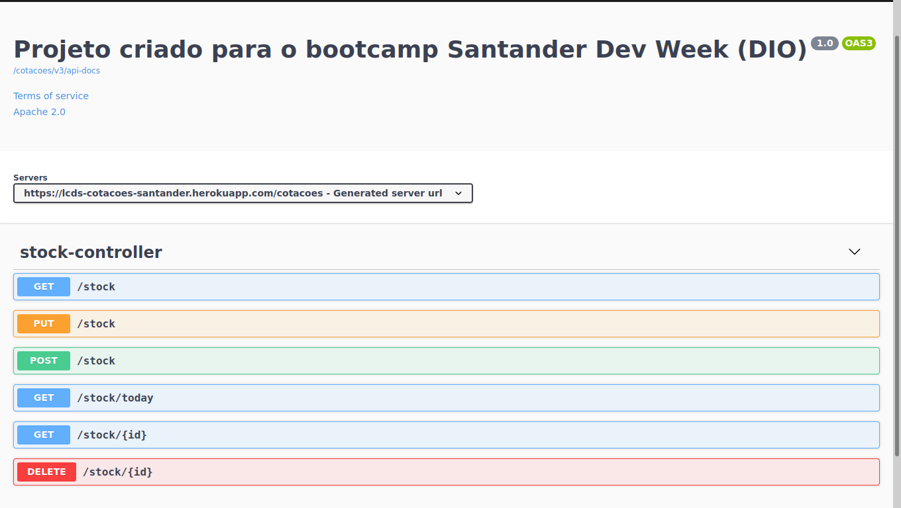

# Tela de cotações - Back-End em Java

> Bootcamp 🚀 = Santader Dev Week

O projeto consiste em um sistema de API de cadastro de cotação do mercado financeiro, neste repositório se encontra a parte back-end com a possibilidade de realizar as requisições através do swagger ui.

 

 

    
Links

    

        <a href="https://lcds-cotacoes-santander.herokuapp.com/cotacoes/swagger-ui.html" rel="noopener">API</a>
        

        <a href="https://github.com/lcds90/cotacoes-santander-java" rel="noopener">Repositorio API</a>
    

    
Resumo Módulo - Back-End

    

    

        Foi utilizado o site <a href="https://start.spring.io/" target="_blank" rel="noopener noreferrer">Spring Initializr</a> 
        Ele oferece um template pronto para começar um projeto com o Maven. 
        O package name define as estruturas de pastas.  
        Foi utilizado a depedencies Spring Web, para facilitar na criação de endpoints REST.  
        O arquivo JAR (Java ARchive) é o projeto compilado.  
        Deploy será no heroku, pois tem integração direta com heroku.
    

    

    Estrutura do projeto
    <ul>
        <li>
            src = source  
            <ul>
                <li>
                    main = Todos os arquivos da aplicação estão centralizados aqui.  
                    <ul>
                        <li>java = a classe main junto com o nome do pacote inicializa a aplicação</li>
                        <li>resources = recursos da aplicaćão que sao utilizadas, troque a extensão do arquivo application de <del>properties</del> para <strong>yml</strong> para melhor visualizacão da estrutura</li>
                    </ul>
                </li>
                <li>test = Todos os testes de unidades estarão presentes nesta pasta.</li>
            </ul>
        </li>
    </ul>
    

    

    Um fator muito importante da utilização do spring, é justamente que ele facilita muitas necessidades do dia a dia do desenvolvimento, sem ter que estar reinventando a roda
    

    

    O maven é uma ferramenta que fica responsável pelo gerenciamento das depedências na aplicação  
    Grande parte das bibliotecas estão disponíveis no site Maven Repository
    

    

    <h2>Objetivos</h2>
    <ol>
        <li>Aprender REST / API / JSON</li>
        <li>Criar camada de Controller</li>
        <li>Criar API's</li>
        <li>Documentar API com OPEN API</li>
    </ol>
    <ul>
        <li>A sigla REST vem de <em>Representational State Transfer</em>, é uma definição de características fundamentais para construção de aplicações web com boas práticas.</li>
        <li>
            A sigla API vem de <em>Application Programming Interface</em>, são conjunto de rotinas e padrões estabelecidos por uma aplicação, é onde o front-end faz as requisições para o back-end  
            <ul>
                <li><strong>GET</strong>: Obter recurso</li>
                <li><strong>POST</strong>: Criar recurso</li>
                <li><strong>PUT</strong>: Atualizar recurso</li>
                <li><strong>DELETE</strong>: Remover recurso</li>
            </ul>
        Toda resposta dos métodos HTTP são retornados com o Code Response
            <ul>
                <li><strong>1XX</strong>: Informações Gerais</li>
                <li><strong>2XX</strong>: Sucesso</li>
                <li><strong>3XX</strong>: Redirecionamento</li>
                <li><strong>4XX</strong>: Erros relacionados ao dados no lado servidor ou cliente</li>
                <li><strong>5XX</strong>: Erro no servidor</li>
            </ul>
        </li>    
        <li>
            <strong>JSON</strong>: Forma genérica de troca de dados entre sistemas.
        </li>
        </ul>
    

    
Utilizamos o controller para divisão de camadas e responsabilidades

    
Antes de criar o endpoint, mapeie a camada do model para abstrair objetos do mundo real, no caso da aplicação seria "stock" 
    No mapeamento do model criamos o <strong>DTO</strong>: Data Transfer Object 

    
Um arquivo Bean é inicializado junto com o Main quando há anotação @Bean

    
Para o Swagger UI, acessar o link http://localhost:8080/cotacoes/swagger-ui/

    <h2>Docker</h2>
    

        Docker é uma ferramenta que trabalha com containers, compartilha recursos de maquina e cria um mini sistema de pastas, uma maquina apartada dentro do root. Consegue trabalhar com dinamismo, subir microserviços, trabalhar com muitas requisiçòes, balanceamento de carga e escalabilidade.
        <ul>
            <li><a href="https://docs.docker.com/" target="_blank">Docker Docs</a> </li>
            <li><a target="_blank" href="hub.docker.com">Hub Docker</a></li>
        </ul>
    

    

    <i>Entity</i>: Banco de dados refletido na aplicação back-end
    

    

        <i>DTO</i>: Possui a responsabilidade de se comunicar com o lado de quem está solicitando a informação fazendo uma requisição
    

    

        <i>Repository</i>: Camada responsavel com a interação do banco de dados. Onde ocorre operaćòes de get, post, put e delete.
    

    

        <i>Service</i>: Determina o que será chamado com a requisição, é a camada intermediária e cuida das regras de negócio.
    

    

        <i>Mapper</i>: Não há como passar puramente o que vem do controller para o service, para a transformação do objeto é criado o mapper
    

 

